# 📊 Sistema de Gerenciamento de Alunos em C++

Este projeto foi estruturado utilizando conceitos essenciais de lógica de programação e estruturas de dados em C++, como vetores (arrays), laços de repetição e estruturas condicionais. 

Abaixo, apresento a explicação passo a passo na ordem exata de execução do fluxo do programa.

---

### 1. Inclusão de Bibliotecas e Namespace
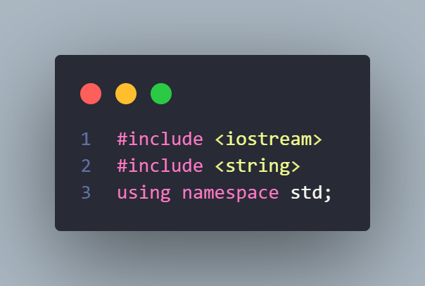

* **O que faz:** Importa as ferramentas essenciais para a execução do código e define o espaço de nomes padrão.
* **Explicação:** A biblioteca `<iostream>` é necessária para permitir a entrada e saída de dados (como `cin` e `cout`), enquanto a `<string>` nos deixa trabalhar com textos de forma simples. O comando `using namespace std;` evita que precisemos digitar `std::` antes de cada comando básico.

---

### 2. Função Principal e Declaração de Variáveis Globais/Estruturas
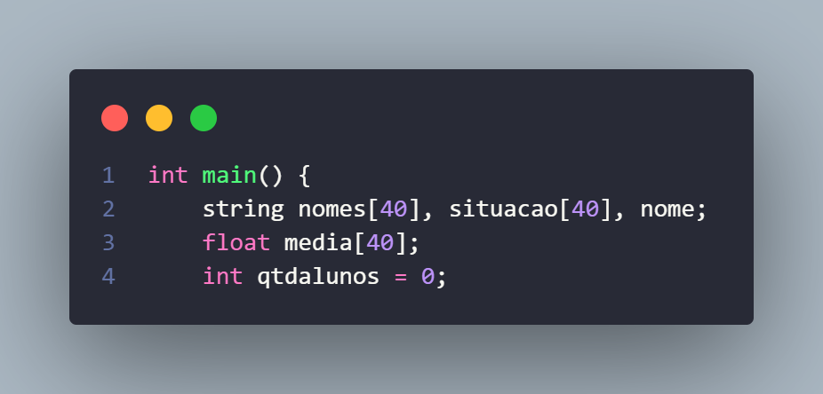

* **O que faz:** Cria o ponto de entrada do programa (`main`) e reserva os espaços de memória essenciais.
* **Explicação:** Aqui nós criamos três vetores (`nomes`, `situacao` e `media`) com capacidade para guardar dados de até 40 alunos simultaneamente de forma paralela. Também inicializamos a variável de controle `qtdalunos` em `0`, que servirá como o nosso contador e guia de índices.

---

### 3. Limitação de Cadastro de Alunos
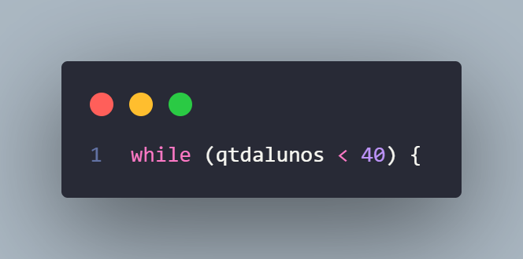

* **O que faz:** Inicia um laço de repetição (`while`) baseado em uma Peanut de condição limite.
* **Explicação:** Para garantir a segurança do programa e evitar estouro de memória (garantindo que não tentaremos acessar posições além do tamanho máximo dos nossos vetores), o sistema só permite a entrada de novos dados enquanto a quantidade atual de alunos cadastrados (`qtdalunos`) for menor que 40.

---

### 4. Condição de Parada Manual
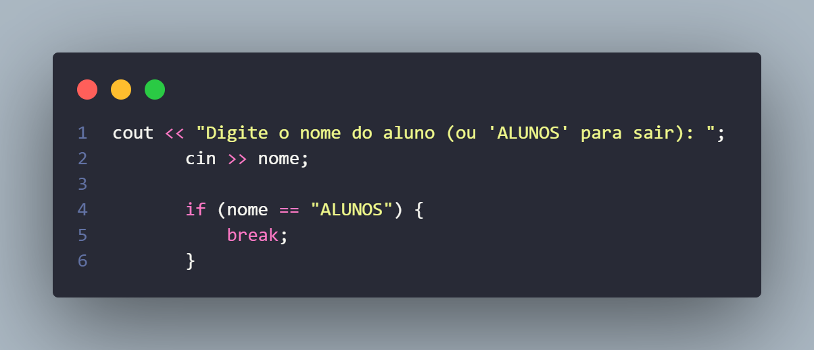

* **O que faz:** Solicita a entrada do nome e verifica uma palavra-chave para interrupção.
* **Explicação:** Focado na experiência do usuário, o programa não obriga o cadastro de todos os 40 alunos. Se o usuário digitar `"ALUNOS"`, a estrutura condicional ativa o comando `break`, que interrompe o laço de repetição imediatamente e direciona o fluxo do programa para o relatório final.

---

### 5. Armazenamento do Nome no Vetor
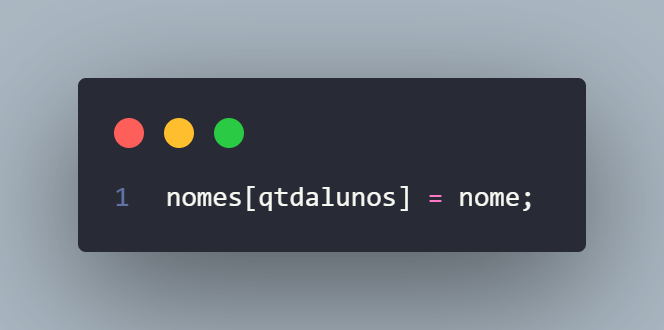

* **O que faz:** Atribui o nome digitado à posição correspondente no vetor global de nomes.
* **Explicação:** A variável `qtdalunos` funciona perfeitamente como o índice do nosso vetor. Se for o primeiro aluno, o valor de `qtdalunos` é `0`, salvando o nome na posição `nomes[0]`, mantendo os dados indexados corretamente.

---

### 6. Inicialização de Variáveis Locais de Notas
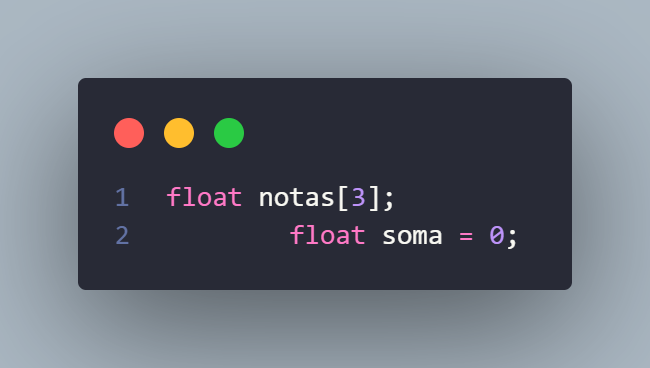

* **O que faz:** Cria um vetor temporário para as notas e zera o acumulador da soma.
* **Explicação:** Como o cálculo de notas é individual, essas variáveis são reiniciadas a cada nova iteração do laço principal. O vetor `notas` reserva espaço para as 3 avaliações daquele aluno específico e a variável `soma` é limpa (definida como `0`) para não acumular as notas do aluno anterior.

---

### 7. Coleta de Notas e Acumulação
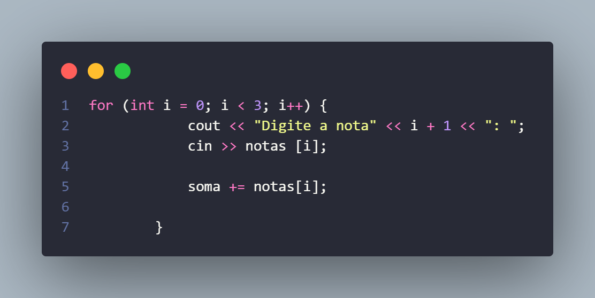

* **O que faz:** Executa um loop determinado de 3 iterações para capturar as notas e somá-las.
* **Explicação:** O laço `for` interage dinamicamente com o usuário exibindo mensagens como `"Digite a nota 1:"`, `"Digite a nota 2:"`, etc. Cada valor inserido é guardado no vetor local e imediatamente adicionado à variável `soma`.

---

### 8. Cálculo e Armazenamento da Média
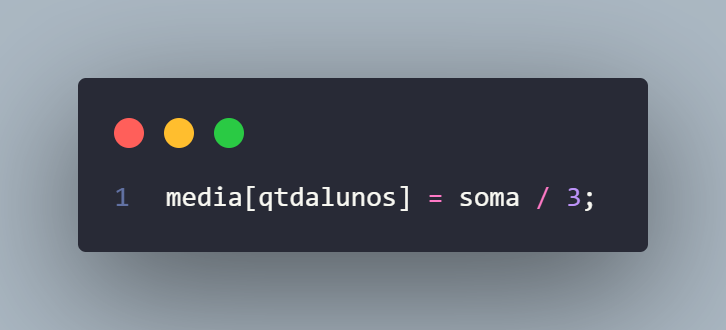

* **O que faz:** Realiza o cálculo da média aritmética do aluno.
* **Explicação:** O programa pega o valor total acumulado na variável `soma` e divide pelo número de avaliações (`3`). O resultado é guardado no vetor global `media`, utilizando novamente o índice `qtdalunos` para ligar essa média ao aluno correspondente.

---

### 9. Estrutura Condicional para Situação Acadêmica
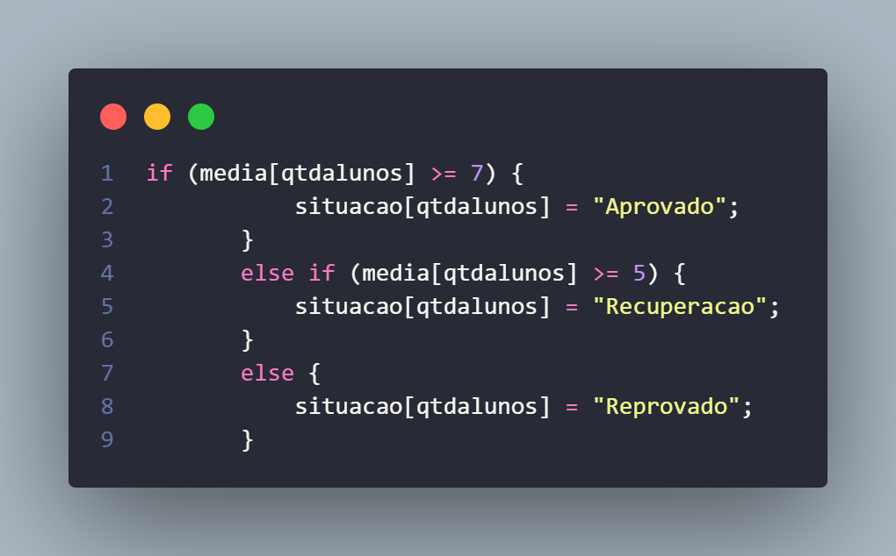

* **O que faz:** Define o status do aluno com base na sua média.
* **Explicação:** Uma estrutura encadeada `if / else if / else` analisa a nota final obtida. Dependendo dos critérios estabelecidos (Média $\ge$ 7 para aprovação direta ou $\ge$ 5 para recuperação), o texto correspondente é salvo no vetor `situacao`.

---

### 10. Feedback Instantâneo do Cadastro
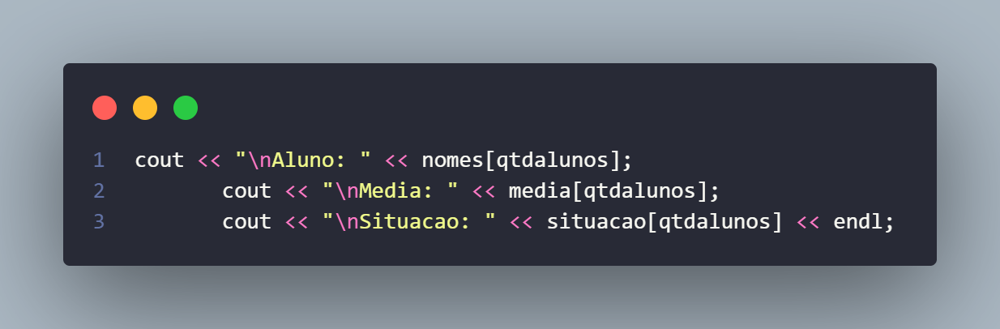

* **O que faz:** Exibe um resumo dos dados coletados na tela do terminal.
* **Explicação:** Assim que o processamento do aluno atual termina, o sistema exibe um relatório rápido com seu nome, média calculada e situação, servindo como uma confirmação visual para o usuário de que a operação foi realizada com sucesso.

---

### 11. Atualização do Índice de Controle
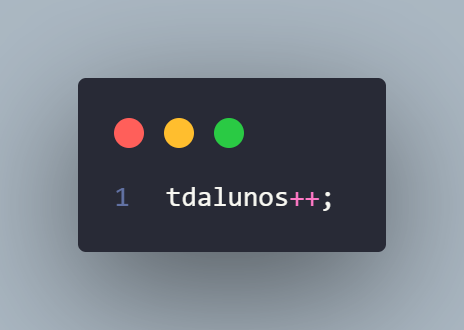

* **O que faz:** Incrementa o contador de alunos.
* **Explicação:** *(Nota de refatoração: no trecho analisado, houve um pequeno erro de digitação na variável do código original, que deveria referenciar `qtdalunos` em vez de `tdalunos`)*. A função deste comando é somar `1` ao contador para que, na próxima rodada do laço, os dados do novo estudante sejam salvos na posição seguinte do vetor, evitando a sobreposição de informações.

---

### 12. Emissão do Relatório Geral e Encerramento
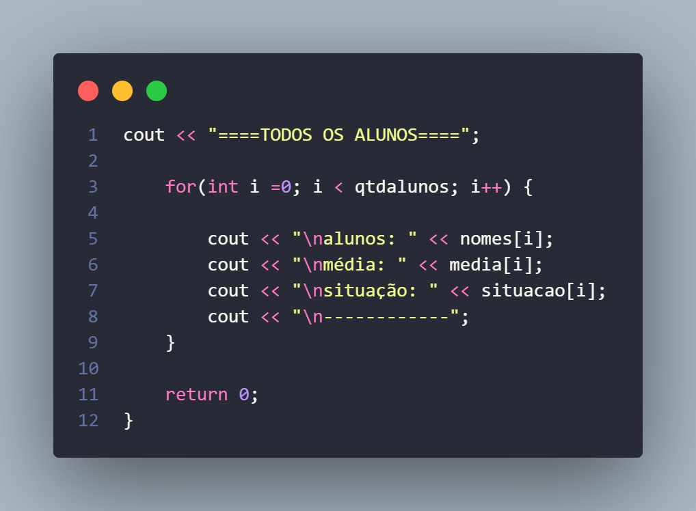

* **O que faz:** Percorre toda a base de dados armazenada e encerra a execução da função principal.
* **Explicação:** Quando o usuário decide encerrar o programa (ou o limite de 40 alunos é atingido), o sistema executes este último bloco. Um laço `for` percorre os vetores do índice `0` até o to0tal armazenado em `qtdalunos`, imprimindo uma lista limpa e organizada com o histórico completo. A linha `return 0;` finaliza o programa informando ao sistema operacional que tudo correu perfeitamente.
